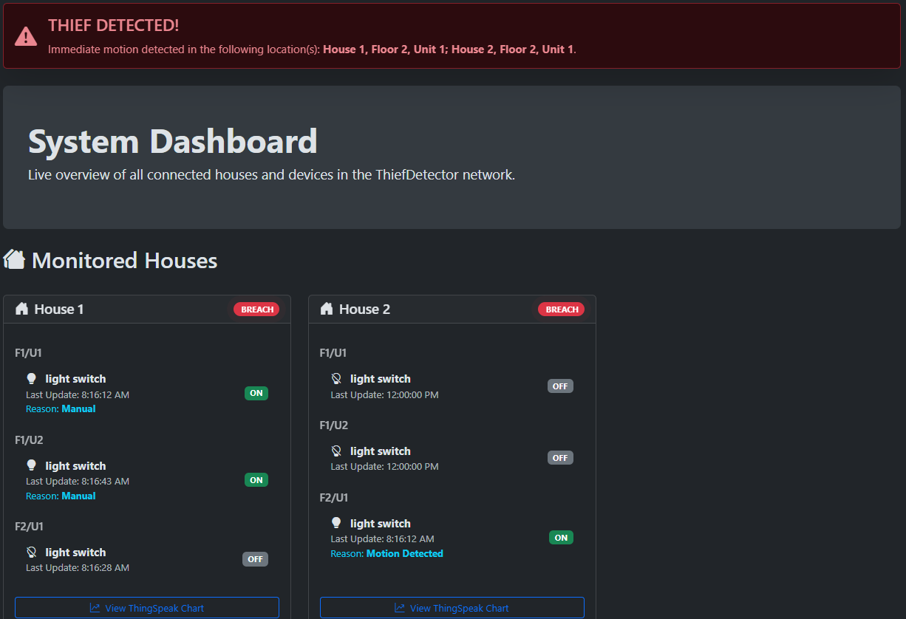
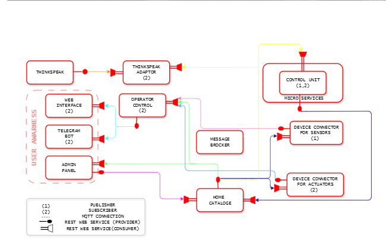

# 🛡️ ThiefDetector IoT System

[](https://www.python.org/)
[](https://www.docker.com/)
[](https://mqtt.org/)

A comprehensive, microservice-based IoT system for home security monitoring.  
This project simulates a network of sensors and actuators to detect and respond to potential intrusions, providing real-time updates through a web dashboard, a ThingSpeak channel, and a Telegram bot.



---

## Features

-   **Microservice Architecture**: Fully containerized using Docker Compose for simple deployment and scalability.
-   **Real-time Web Dashboard**: A dynamic single-page application offering a live overview of all connected devices and their statuses.
-   **Admin Management Panel**: A dedicated interface to manage houses, floors, units, and connected devices.
-   **Intelligent Automation**: Automatically turns on lights when motion is detected or ambient light is low. Also displays the reason for each action on-screen.
-   **Dynamic Alerts**: Global and per-house alerts that automatically expire after inactivity to maintain a clean UI.
-   **Cloud Integration**: Sends sensor and actuator data to ThingSpeak for historical analysis and visualization.
-   **Remote Control & Alerts**: Telegram bot support for device monitoring and real-time motion alerts.
-   **Dynamic Service Discovery**: A central Catalog service allows components to discover each other dynamically within the Docker network.

---

## Technology Stack

-   **Backend**: Python, CherryPy, Flask  
-   **Frontend**: HTML, CSS, JavaScript, Bootstrap 5  
-   **Messaging**: MQTT (Eclipse Mosquitto Broker)  
-   **Containerization**: Docker & Docker Compose  

---

## Architecture Overview

The system follows a modular microservice architecture, where each component runs in its own Docker container.  
Services communicate through REST APIs for configuration and use MQTT for real-time message exchange.



### Microservice Connections

| From Service             | To Service                 | Connection Type | Role                                     | Purpose                                                                 |
| ------------------------ | -------------------------- | --------------- | ---------------------------------------- | ----------------------------------------------------------------------- |
| **Sensors**              | **Message Broker**         | MQTT            | Publisher                                | Publishes sensor data (light, motion).                                  |
| **Control Unit**         | **Message Broker**         | MQTT            | Subscriber & Publisher                   | Subscribes to sensor data, publishes control commands.                  |
| **Actuators**            | **Message Broker**         | MQTT            | Subscriber                               | Subscribes to control commands to change state.                         |
| **ThingSpeak Adaptor**   | **Message Broker**         | MQTT            | Subscriber                               | Subscribes to sensor data for cloud logging.                            |
| **Telegram Bot**         | **Message Broker**         | MQTT            | Subscriber                               | Subscribes to motion and system alerts.                                 |
| **Operator Control**     | **Sensors & Actuators**    | REST            | Consumer                                 | Fetches current list/status of devices.                                 |
| **Operator Control**     | **Home Catalog**           | REST            | Consumer                                 | Retrieves overall structure of houses/units.                            |
| **Web Interface**        | **Operator Control**       | REST            | Consumer                                 | Retrieves all dashboard data.                                           |
| **Telegram Bot**         | **Operator Control**       | REST            | Consumer                                 | Retrieves on-demand status reports.                                     |
| **Admin Panel**          | **Home Catalog**           | REST            | Consumer & Provider                      | Reads/updates system configuration (add/remove/edit items).             |
| **Control Unit**         | **Home Catalog**           | REST            | Provider                                 | Updates device status and action reasons.                               |
| *All Services*           | **Home Catalog**           | REST            | Consumer                                 | Retrieves initial configuration (e.g., broker IP).                      |

---

## Configuration

Before running the system, configure the following credentials:

1.  **ThingSpeak API Keys**:
    -   Open `ThingSpeak/adaptor.py`
    -   Update the `self.api_keys` dictionary with your own ThingSpeak Channel Write API Keys.

2.  **Telegram Bot Token**:
    -   Open `User_awareness/telegram_bot.py`
    -   At the bottom of the file, replace the `token` placeholder with your Telegram bot token from BotFather.

3.  **Telegram User ID (Device Ownership)**:
    -   Open Telegram and talk to `@userinfobot` to get your Chat ID.
    -   Open `User_awareness/device_ownership.json`
    -   Replace `"592396681"` with your own Chat ID to claim ownership of a device.

---

## Getting Started with Docker

This project is fully containerized for seamless setup and deployment.

### Prerequisites

-   [Docker](https://www.docker.com/get-started)
-   [Docker Compose](https://docs.docker.com/compose/install/)

### Installation & Launch

1.  **Clone the Repository**
    ```bash
    git clone <your-repository-url>
    cd <your-repository-folder>
    ```

2.  **Perform Configuration**
    -   Follow the **Configuration** section above to insert your API keys and tokens.

3.  **Build and Run the System**
    ```bash
    docker-compose up --build
    ```
    -   This command builds Docker images and launches all services.

4.  **Access the Dashboard**
    -   Open your browser and go to:
    -   **`http://localhost:8000`**

5.  **Use the Telegram Bot**
    -   Find your bot on Telegram and use the `/menu` command to interact with the system.

---

## Managing the System

A built-in **Admin Panel** allows full control over your system's structure.

-   **Access**: Open **`http://localhost:8081`** after system startup.

### Adding Houses and Devices

With the Admin Panel, you can:
-   Add new houses, floors, and units.
-   Add new motion sensors to units.
-   Remove individual devices from any unit.

**Important**: After adding a device, update one of the following files manually:
-   `Device_connectors/setting_sen.json` (for sensors)
-   `Device_connectors/setting_act.json` (for actuators)

This is required because the device connector services read from these static files during startup.

### Removing a House

Currently, the Admin Panel does **not** support deleting an entire house.

To remove a house:
-   Open `catalog.json` manually.
-   Delete the corresponding house object from the `housesList` array.

---
